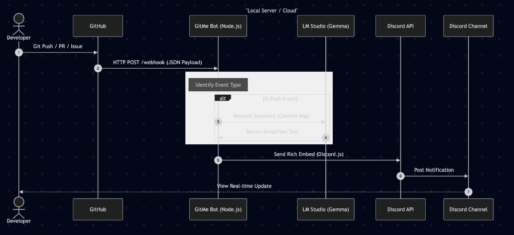

# GitMe Bot Workflow 

GitMe is an AI-powered Discord bot that provides human-readable summaries of GitHub activities. This document outlines the technical workflow and system architecture of the bot.

## Core Workflow

The bot follows a reactive event-driven architecture triggered by GitHub webhooks.

1.  **Event Trigger**: A developer performs an action on a tracked GitHub repository (Push, Pull Request, or Issue).
2.  **Webhook Delivery**: GitHub sends a secure HTTP POST request containing a JSON payload to the GitMe bot's `/webhook` endpoint.
3.  **Payload Processing**: The `webhookController` parses the request, identifies the event type, and validates the data.
4.  **AI Summarization (Pushes Only)**: 
    *   For commit messages, the `aiService` is invoked.
    *   It sends the technical commit message to a local **LM Studio** instance (running a model like **Gemma**).
    *   The LLM generates a concise, layman-friendly summary.
5.  **Notification Construction**: The `discordService` takes the event details (and AI summary) to create a "Rich Embed" with:
    *   Color-coded indicators (Green for features, Red for fixes, Purple for merges).
    *   Author information and avatars.
    *   Direct links to the GitHub event.
6.  **Discord Delivery**: The notification is posted to the configured Discord channel using the **Discord.js** library.

---

## System Architecture Diagram

The diagram below illustrates the flow of data between GitHub, the GitMe bot, the local AI model, and Discord.

---

## Component Responsibilities

| Component | Responsibility |
| :--- | :--- |
| **`index.js`** | Application entry point; initializes Express server and routes. |
| **`webhookController.js`** | Orchestrates the primary flow; handles GitHub payload parsing and logic branching. |
| **`aiService.js`** | Communicates with the local LM Studio API to generate natural language summaries. |
| **`discordService.js`** | Handles Discord Embed formatting and communication with the Discord API. |
| **`env.js`** | Manages environment configurations (tokens, IDs, model names). |

---

## Feature Comparison by Event

| Event Type | AI Summary | Embed Color | Key Metadata Included |
| :--- | :--- | :--- | :--- |
| **Push** | ✅ Yes | Blue/Varies | Branch, Commit Hash, Author |
| **Pull Request** | ❌ No | Green (Open) / Purple (Merged) | Base/Head Branches, Title |
| **Issue** | ❌ No | Green (Open) / Red (Closed) | Issue Title, Body Snippet |
